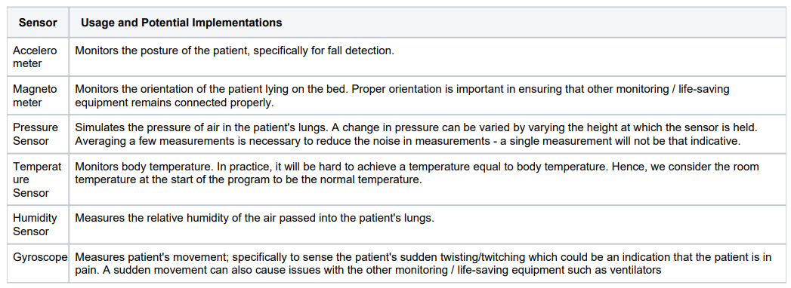
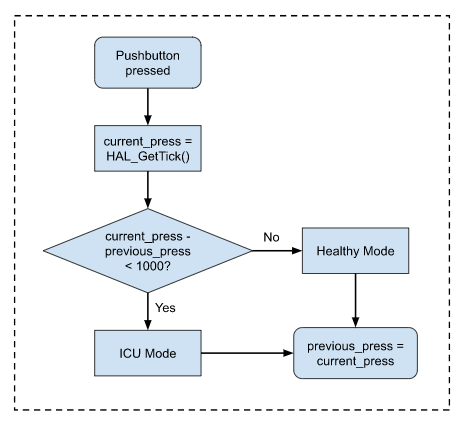
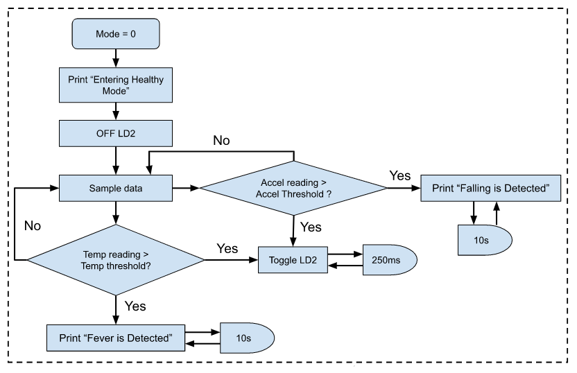
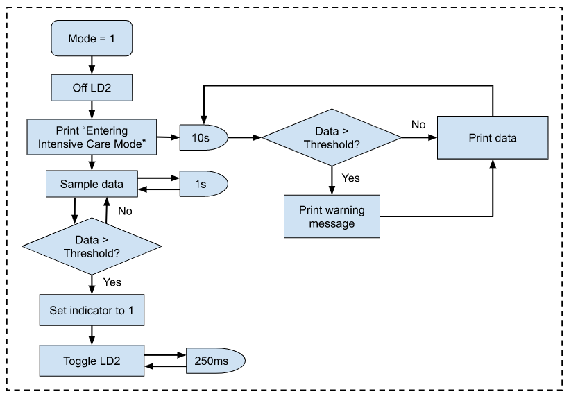
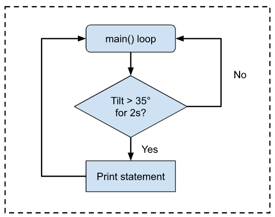

# COvid Patients Enhanced Monitoring (COPEMON) with **STM32L475VG**

## 1. Introduction & Objectives

Coronavirus disease (COVID-19) is an infectious disease caused by a newly discovered coronavirus. Most people infected with COVID-19 will start to experience symptoms like fever, dry cough, tiredness, etc. This disease may not be deadly for young to middle aged people, but has proved to be deadly and even fatal, especially for the elderly. This is so especially in countries like Singapore with an increasing ageing population.

In this project, we will be implementing a system, known as COvid Patients Enhanced MONitoring (COPEMON) that enhances the monitoring of COVID patients, especially elderly COVID patients. This system sends data periodically to a server known as CHIP Associated Cloud Unit (CHIPACU), which simulates an Internet of Things (IoT) server, whenever certain conditions are met. This will allow us to better monitor the patients, and to show warning signs whenever something abnormal is detected in the patient.

It is assumed that the board is a larger prototype version of COPEMON, with several output devices to help in the debugging during development. CHIPACU is the terminal program running on the PC that communicates with the STM32 chip.

COPEMON has 2 modes of operation:

* Healthy mode
* Intensive Care mode

The following sensors on the board and their implementations are as shown:



The objectives include:

* using interrupt programming to have fast responses to inputs
* integrating peripherals seamlessly with our program

## 2. Flowcharts

### 2.1 Pushbutton Flowchart (Interrupt)



### 2.2 Healthy Mode Flowchart (Mode = 0)



* Only TEMPERATURE_SENSOR & ACCELEROMETER enabled

### 2.3 Intensive Care Mode Flowchart (Mode = 1)



* ALL sensors enabled

### 2.4 Tilt Detection Flowchart (Interrupt)



## 3. Detailed implementation

Mode is the variable that differentiates between Healthy (mode = 0) and Intensive Care Mode (mode = 1). The indicators are used to mark when the thresholds are crossed in both modes and will stay constant until the mode is changed. Current_press and previous_press are used for button detection.

```c
//Mode == 0 (Healthy Mode), Mode == 1 (ICU Mode)
volatile int mode = 0;

//Indicators for when threshold is crossed
volatile int fever_detect = 0;
volatile int fall_detect = 0;
volatile int pain_detect = 0;
volatile int abnormal_detect = 0;
volatile int breath_detect = 0;

//Detect PB intervals
volatile int current_press = 0;
volatile int previous_press = 0;
```

HAL, UART and peripherals are initialized. LD2 is configured. PC13, which is the pushbutton, and PD11, which is the LSM6DSL, are configured as an external interrupt. All these are done in the main loop before the while(1) loop.

```c
initialise_monitor_handles(); //for semi-hosting support (printf)

/* Reset of all peripherals, Initializes the Flash interface and the Systick. */
HAL_Init();

/* UART initialization  */
UART1_Init();

//Configure PC13 to EXTI mode
BSP_PB_Init(BUTTON_USER, BUTTON_MODE_EXTI);

/* Peripheral initializations using BSP functions */
BSP_ACCELERO_Init();
BSP_GYRO_Init();
BSP_HSENSOR_Init();
BSP_TSENSOR_Init();
BSP_MAGNETO_Init();
BSP_PSENSOR_Init();

//Configure LD2
MX_GPIO_Init();

//Configure PD11 as External Interrupt
EXTI_PD11_Init();
LSM6DSL_Init();
```

Variables are declared to be used for sensor data later on.

```c
//Variables declaration
float temp_data; //Body Temperature Monitoring

float accel_data[3]; //Fall Detection
int16_t accel_data_i16[3] = { 0 };      // array to store the x, y and z readings.

float gyro_data[3]; //Pain Detection
float gyroscope_data;

float magneto_data[3]; //Lying Monitoring
int16_t magneto_data_i16[3] = { 0 };  // array to store the x, y and z readings.

float humid_data; //Respiratory Monitoring
float pressure_data; //Respiratory Monitoring
```

The sensors were then tested in various conditions and appropriate threshold values were set. The timer values are used to set the LED blinking frequency later on and the transmission number is used for the printing of the data in ICU mode. Declaring it here ensures that there is continuity within the transmissions even if the mode is changed unless the board is powered off or externally reset.

```c
//Threshold
int TEMP_THRESHOLD = 33.5;
int ACC_THRESHOLD[3];
ACC_THRESHOLD[2] = 8;
int GYRO_THRESHOLD = 10000;
int MAG_THRESHOLD[3];
MAG_THRESHOLD[0] = -0.6;
MAG_THRESHOLD[1] = -13;
MAG_THRESHOLD[2] = 4;
int HUMID_THRESHOLD = 75;
int PRESS_THRESHOLD = 1020;

//Timer
int T01;
int T02;

//transmission number
int num = 0;
```

The logic for the remaining codes are as shown in the flowcharts above.
